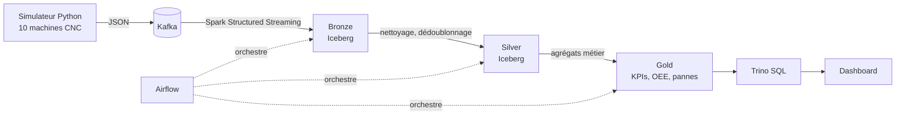

# CNC Lakehouse

Plateforme data **temps réel** pour un atelier de 10 machines CNC simulées :
ingestion en streaming, lakehouse en couches (Bronze / Silver / Gold), qualité des données,
orchestration et tableaux de bord.

> Projet personnel de Data Engineering, construit étape par étape sur une machine locale (16 Go de RAM).

## Architecture cible



## Avancement

- [x] **Étape 1** : Kafka + simulateur de machines (données volontairement imparfaites)
- [x] **Étape 2** : stockage objet MinIO + tables Iceberg + Spark Streaming vers Bronze
- [ ] **Étape 3** : couche Silver (dédoublonnage, retards, valeurs aberrantes)
- [ ] **Étape 4** : couche Gold (disponibilité, OEE, MTBF/MTTR) + Trino
- [ ] **Étape 5** : orchestration Airflow
- [ ] **Étape 6** : tests de qualité des données + CI GitHub Actions
- [ ] **Étape 7** : dashboard + détection d'anomalies (maintenance prédictive)

## Données simulées

| Topic Kafka | Contenu | Clé |
|---|---|---|
| `cnc.telemetry` | 1 mesure par machine par seconde : vitesse de broche, température, vibrations, puissance, usure de l'outil | `machine_id` |
| `cnc.machine-events` | changements d'état : panne (avec code), maintenance corrective ou préventive, pause, reprise | `machine_id` |

Environ 2 % des mesures sont volontairement défectueuses (doublons, retards de 5 à 30 min,
valeurs nulles, valeurs impossibles) pour être traitées dans la couche Silver.

## Démarrage rapide

Prérequis : Docker Desktop, [uv](https://docs.astral.sh/uv/).

```bash
cp .env.example .env          # identifiants locaux de MinIO
docker compose up -d --build  # toute la stack (le premier build télécharge les jars Spark)
uv sync                       # dépendances Python
uv run pytest                 # tests du simulateur
uv run python -m data_simulator
```

| Service | Rôle | Interface |
|---|---|---|
| Kafka | file de messages temps réel | Kafka UI : http://localhost:8085 |
| MinIO | stockage objet compatible S3 (fichiers Parquet) | console : http://localhost:9001 |
| Iceberg REST | catalogue des tables Iceberg | API : http://localhost:8181/v1/config |
| Spark (`spark-bronze`) | streaming Kafka → tables Bronze | Spark UI : http://localhost:4040 |

Vérifier le contenu de Bronze :

```bash
docker exec spark-bronze /opt/spark/bin/spark-sql -S -e "SELECT count(*) FROM bronze.telemetry"
```

## Couche Bronze

Le job [`spark/jobs/kafka_to_bronze.py`](spark/jobs/kafka_to_bronze.py) lit les deux topics en
continu (micro-batch toutes les 10 s) et écrit dans `bronze.telemetry` et `bronze.machine_events`.

- **Données brutes** : le JSON est gardé tel quel (`payload`) avec ses métadonnées Kafka
  (partition, offset, horodatage). Un message invalide ne bloque jamais l'ingestion.
- **Exactement une fois** : le checkpoint Spark et les commits Iceberg garantissent qu'après un
  arrêt, le job reprend là où il s'était arrêté, sans perte ni doublon (testé).
- **Partitionnement** par jour d'arrivée dans Kafka.

Options du simulateur (aussi réglables par variables d'environnement) :

| Option | Variable d'environnement | Défaut |
|---|---|---|
| `--bootstrap-servers` | `KAFKA_BOOTSTRAP_SERVERS` | `localhost:29092` |
| `--interval` | `SIMULATOR_INTERVAL_S` | `1.0` |
| `--dirty-rate` | `SIMULATOR_DIRTY_RATE` | `0.02` |
| `--seed` | `SIMULATOR_SEED` | aléatoire |
| `--max-ticks` | `SIMULATOR_MAX_TICKS` | `0` (sans fin) |

## Structure du projet

```
cnc-lakehouse/
├── docker-compose.yml             # infrastructure locale
├── .env.example                   # modèle des identifiants (copier en .env)
├── pyproject.toml                 # dépendances Python (uv)
├── spark/
│   ├── Dockerfile                 # Spark 3.5 + connecteurs Kafka et Iceberg
│   ├── conf/spark-defaults.conf   # catalogue Iceberg, accès à MinIO
│   └── jobs/kafka_to_bronze.py    # streaming Kafka -> Bronze
├── data_simulator/
│   ├── models.py                  # structures : Status, MachineSpec, MachineState
│   ├── machines.py                # catalogue : les 10 machines, les codes de panne
│   ├── generator.py               # simulation : usure, pannes, mesures, données sales
│   ├── config.py                  # réglages : environnement + ligne de commande
│   ├── producer.py                # envoi vers Kafka
│   ├── main.py                    # point d'entrée : relie tout
│   └── __main__.py                # permet "python -m data_simulator"
└── tests/
    ├── test_machine_catalog.py
    ├── test_generator.py
    └── test_config.py
```
